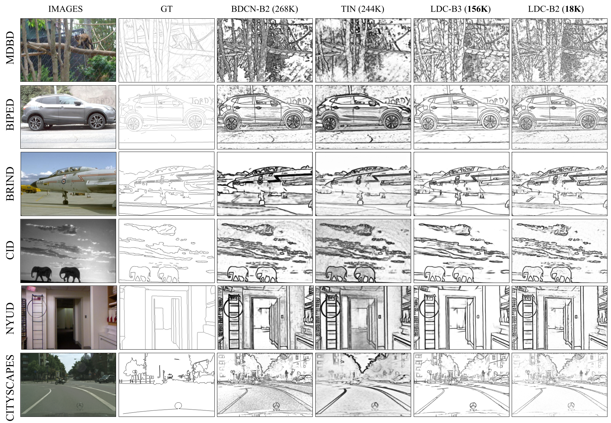

# LDC: Lightweight Dense CNN for Edge Detection
With the same purpose and features as [DexiNed](https://github.com/xavysp/DexiNed), LDC is a straightforward CNN based model
for edge detection. LDC has just ~0.7M parameters, it can reduce your time of training and testing. This model is trained
only in on datasets prepared for edge detection. Before using this repo, we highly recommend read our paper in 
[LDC: Lightweight Dense CNN for Edge Detection](http://refbase.cidis.espol.edu.ec/show.php?record=183&submit=Cite&citeType=PDF).
check the results below.

<div style="text-align:center">
</div>

## Requirements

* [Python >= 3.7](https://www.python.org/downloads/release/python-370/g)
* [Pytorch >=1.6](https://pytorch.org/)
* [OpenCV](https://pypi.org/project/opencv-python/)
* [Matplotlib](https://matplotlib.org/3.1.1/users/installing.html)
* [Kornia](https://kornia.github.io/)
* Other package like Numpy, h5py, PIL, json. 

## Install in your local PC

Once the packages are installed,  clone this repo as follow: 

    git clone https://github.com/xavysp/LDC.git
    cd LDC
## Project Architecture

```
├── data                        # Sample images for testing (paste your image here)
|   ├── (Some images            # Images to test LDC
├── img                         # Images used in README.md
|   └── banner.png              # LDC banner
├── utls                        # A series of tools used in this repo
|   └── img_processing.py       # Miscellaneous tool functions
├── datasets.py                 # Tools for dataset managing 
├── losses2.py                   # Loss function used to train DexiNed (BDCNloss2)
├── main.py                     # The main python file with main functions and parameter settings
                                # here you can test and train
├── modelB4.py                  # LDC (4 blocks) class in pythorch
└── modelB5.py                  # LDC (5 blocks) class in pythorch
```

## Test

In dataset.py you will find most of the dataset used in edge, contour, and boundary detection.
If you have you own dataset copy and paste in data folder and run the code bellow
    
    python main.py --choose_test_data==-1

## Train

Check the dateset you have for training, set them in dataset.py and main.py---line 216-350. Then
run the following code:

    python main.py

## Acknowledgement

* We like to thanks to the previous repo: [DexiNed](https://GitHub.com/xavysp/LDC) and [CATS](https://github.com/WHUHLX/CATS)


# Citation

If you like LDC, why not starring the project on GitHub!

[](https://GitHub.com/xavysp/LDC/stargazers/)

Please cite our paper if you find helpful in your academic/scientific publication,
```
@article{xsoria2022ldc,
author = {X. Soria and W. Pomboza-junez and A. Sappa},
title = {LDC: Lightweight Dense CNN for Edge Detection},
year = {2022},
volume = {10},
issn = {},
pages = {1912-1921},
keywords = {image edge detection;convolution;training;feeds;machine learning;task analysis;kernel},
doi = {10.1109/WACV45572.2020.9093290},
url = {https://doi.ieeecomputersociety.org/10.1109/WACV45572.2020.9093290},
publisher = {IEEE Access},
address = {Los Alamitos, CA, USA},
month = {Jun}
}
```
